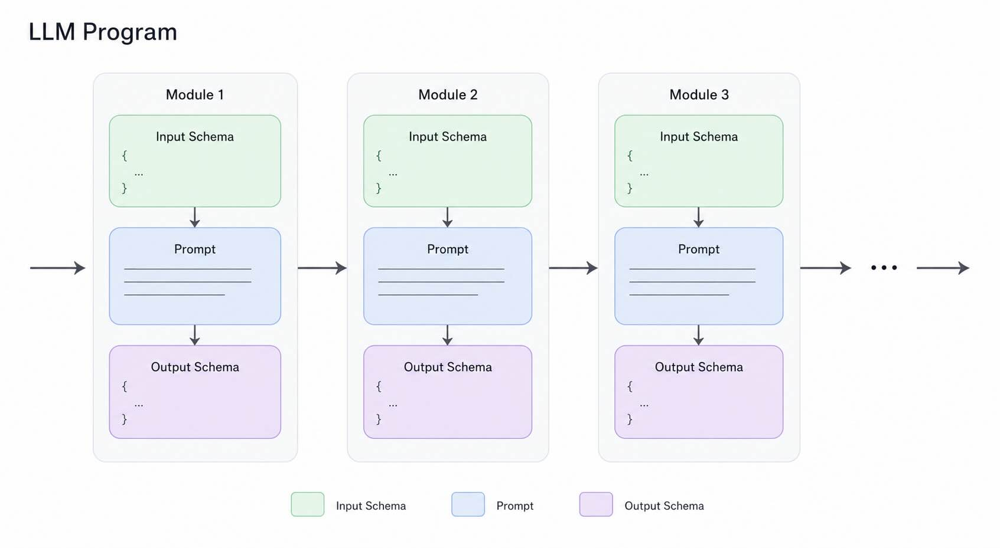
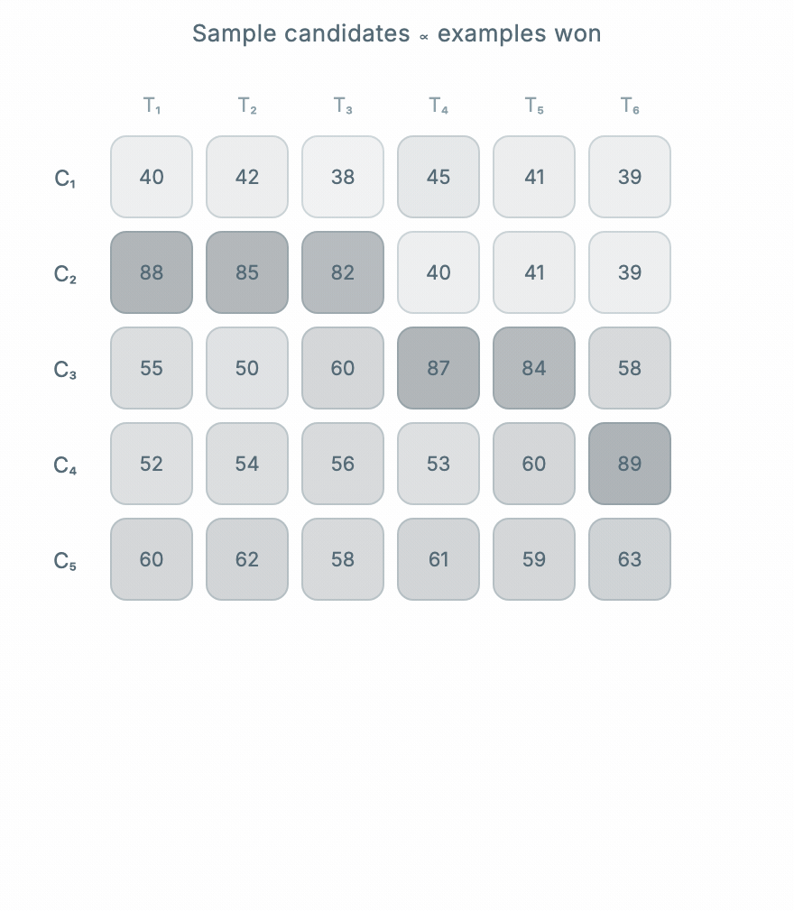
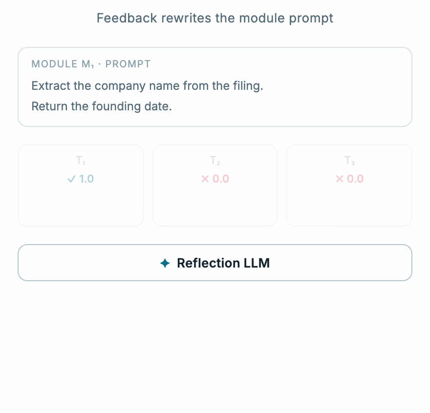
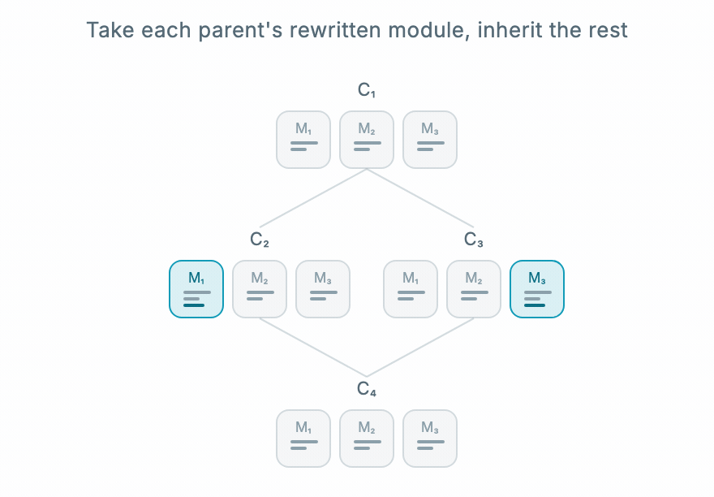
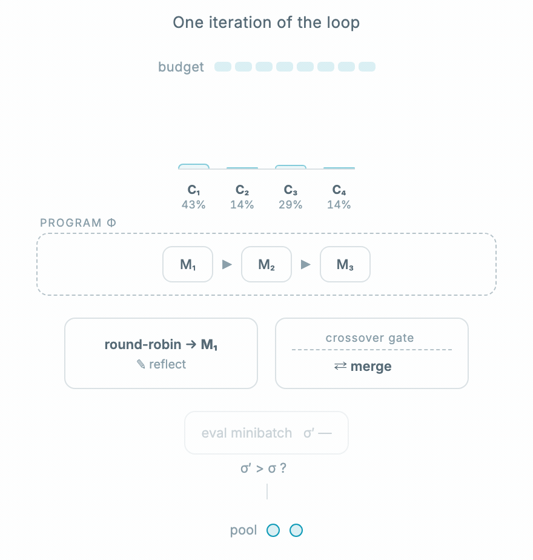

# GEPA-Go

This repo is the Go port of the GEPA algorithm. It currently ships as a CLI binary.

arXiv: https://arxiv.org/abs/2507.19457

## Usage

```bash
go build -o gepa ./cmd/gepa

export API_KEY=...
export BASE_URL=...

./gepa optimize \
  --program examples/smoke_minimal/program.json \
  --config examples/smoke_minimal/config.json \
  --train examples/smoke_minimal/train.jsonl \
  --val examples/smoke_minimal/val.jsonl
```

**Caution:** This implementation is unstable and mostly for educational purposes.

For the canonical version, check out the [DSPy implementation](https://github.com/stanfordnlp/dspy).

## Basics

GEPA treats prompts as evolvable components of an LLM program, which are evolved using a labeled dataset and metadata consisting of module-level evaluations, validation, and LLM traces.

## Components

### Program
A program is a series of LLM modules that are executed in series. Think of a module as a line of code in a program. A module is essentially the following triple: (input_schema, output_schema, prompt). A gate is a module with boolean output. A program could also have other fields such as tools and external evaluators, which are not strictly necessary.



### Candidate

If a program is composed of modules $M_1, M_2, M_3, ..., M_k$, a candidate is defined as an ordered list of prompts $P1, P2, P3, ..., P_k$.

### Dataset

A dataset consists of inputs to the program and labels or correct answers. Again, the dataset could contain correct answers for each module, but those are not strictly necessary here.

### Pareto sampling
Pareto frontier refers to a list of candidates that do best on at least one of the training examples. Sampling from the Pareto set is weighted based on the number of candidate wins.



### Update Step: Reflection and Crossover

#### Reflection
Reflection is the primary mechanism of prompt update. A module is selected per iteration in round-robin fashion and a reflection LLM takes the evaluation traces and mutates the module prompt.



#### Merge/Crossover
Merge is only possible when 2 parents have a single ancestor. A child candidate is formed by merging prompts from different modules.



## Algorithm

The number of iterations of the algorithm is controlled by a **budget**, where 1 unit of budget is equivalent to 1 rollout.

A single iteration of GEPA is straightforward.

1. Sample from the Pareto frontier
2. Check for eligibility for merge and mutation
3. Perform update
4. Evaluate on a subset of the samples known as a mini-batch
5. If it outperforms the parent, evaluate on the full training set and add to the candidate pool.



